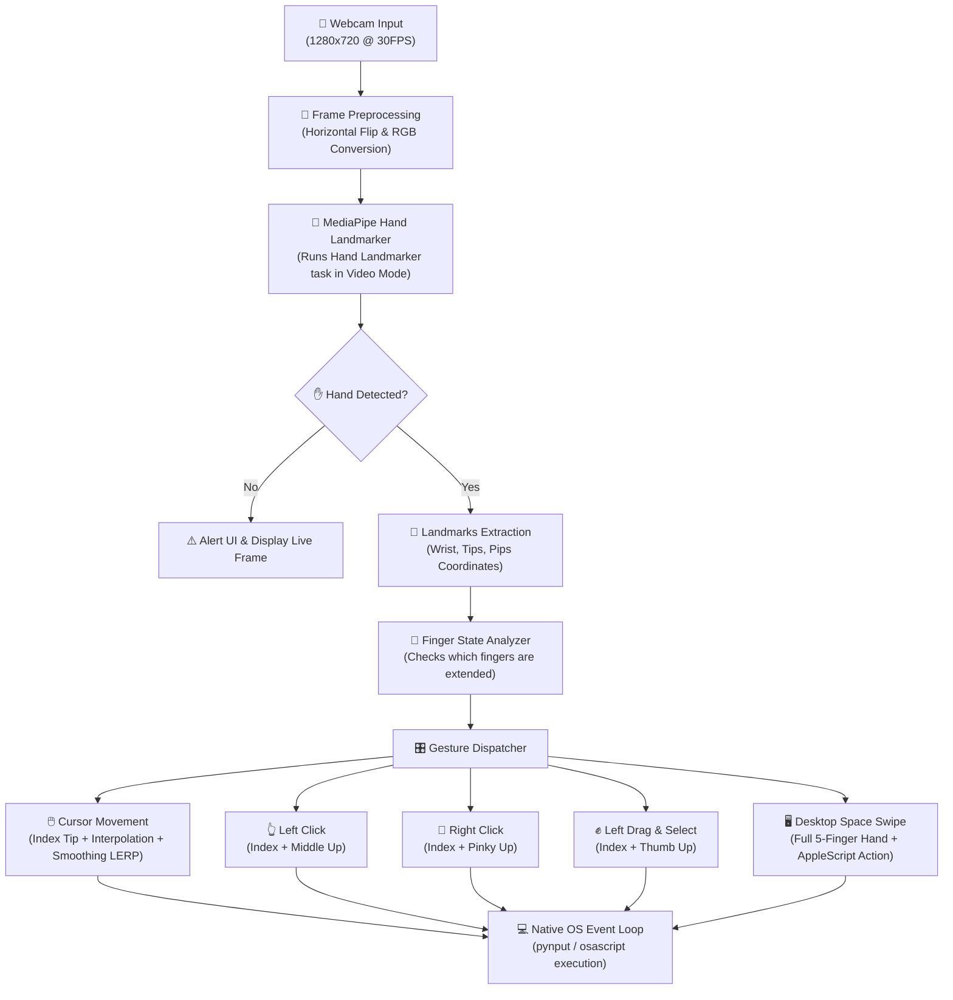

# 🚀 AeroMouse CV: AI-Powered Virtual Mouse

AeroMouse CV is a state-of-the-art computer vision application that turns your physical hand into a high-precision virtual mouse. By combining **Google MediaPipe Hand Landmarker** with **OpenCV** and native OS controllers, AeroMouse CV translates hand postures and movements into mouse tracking, clicking, dragging/selecting, and workspace swiping gestures in real-time.

---

## 🏗️ Architecture & Flow Scheme

Below is the technical pipeline of AeroMouse CV from frame capture to system interaction:



---

## 📂 Directory Structure

Here is the organization of the AeroMouse CV project:

```text
Vitrual-Mouse-CV/
├── Hand_Tracking_Model/
│   ├── hand_landmarker.task   # 🧠 Pre-trained MediaPipe hand landmark model
│   ├── landmarks.png          # 🖼️ Visual guide of MediaPipe landmark coordinates
│   └── utils.py               # 🛠️ Hand detection helper class wrapper
├── main.py                    # 🎮 Core application execution loop & state manager
├── utils.py                   # 🧮 Mathematical calculators & gesture handlers
├── requirements.txt           # 📦 Project dependencies
└── README.md                  # 📖 Project documentation
```

---

## 📄 File Details

*   **[main.py](file:///Users/wess/Desktop/computer%20vision/Vitrual%20Mouse%20CV/main.py)**: The main entry point. Orchestrates the webcam capture, runs the loop, extracts hand landmarks using the detector, translates normalized points to screen coordinates, and routes active finger combinations to mouse/keyboard controllers.
*   **[utils.py](file:///Users/wess/Desktop/computer%20vision/Vitrual%20Mouse%20CV/utils.py)**: Contains math operations, coordinates calculations, FPS calculation overlays, and the AppleScript/Keyboard system-swipe handlers.
*   **[Hand_Tracking_Model/utils.py](file:///Users/wess/Desktop/computer%20vision/Vitrual%20Mouse%20CV/Hand_Tracking_Model/utils.py)**: Contains the `handDetector` helper class which wraps the MediaPipe Hand Landmarker API initialization and landmark rendering styles.
*   **[Hand_Tracking_Model/hand_landmarker.task](file:///Users/wess/Desktop/computer%20vision/Vitrual%20Mouse%20CV/Hand_Tracking_Model/hand_landmarker.task)**: Google's pre-trained deep learning binary model for real-time 21 3D-hand landmark localization.

---

## 🧮 How It Works (Core Logic)

### 1. Finger Extension Check (get_fingers_up)
To determine if a finger is "up", the system calculates the Euclidean distance from the wrist (Landmark `0`) to the finger tip and compares it to the distance from the wrist to the Proximal Interphalangeal (PIP) joint:

$$\text{distance}(P_1, P_2) = \sqrt{(x_2 - x_1)^2 + (y_2 - y_1)^2}$$

If the tip distance is greater than the PIP distance, the finger is classified as extended. For the thumb, the distance from the tip to the pinky base (Landmark `17`) is used.

### 2. Coordinate Mapping & Bounding Box
To prevent the hand from needing to reach the extreme edges of the camera view to click corners, a boundary margin of `frameR = 125` is drawn. The coordinates inside this box are interpolated linearly to the screen resolution using NumPy:

$$x_{screen} = \text{interp}(x_{cam}, [frameR, W_{cam} - frameR], [0, W_{scr}])$$

### 3. Cursor Smoothing (LERP)
To eliminate natural hand tremors and jitter, a Linear Interpolation (LERP) smoothing filter is applied:

$$X_{smooth} = X_{prev} + \frac{X_{current} - X_{prev}}{\text{smoothening}}$$

Here, `smoothening = 15` creates a highly fluid, latency-optimized movement trail.

### 4. macOS Space Swiping via AppleScript
Desktop space switching is sent directly to the window server via AppleScript to bypass OS-level accessibility permission restrictions:
```applescript
tell application "System Events" to key code 123 (or 124) using control down
```

---

## 🛠️ Setup & Requirements

### Dependencies
*   Python 3.9+
*   OpenCV (`opencv-python`)
*   MediaPipe (`mediapipe`)
*   pynput (`pynput`)
*   screeninfo (`screeninfo`)

### Step-by-Step Installation

1.  **Clone the workspace directory & enter it:**
    ```bash
    cd "/Users/wess/Desktop/computer vision/Vitrual Mouse CV"
    ```

2.  **Create and activate a virtual environment:**
    ```bash
    python3 -m venv .venv
    source .venv/bin/activate
    ```

3.  **Install dependencies:**
    ```bash
    pip install -r requirements.txt
    ```

4.  **Run the application:**
    ```bash
    python3 main.py
    ```

---

## 🎮 Controls / Usage

Position your hand in front of the webcam. Use the following gestures to interact:

| Gesture | Fingers Extended | Action |
| :--- | :--- | :--- |
| **Move Cursor** | Index Finger Only | Move mouse pointer smoothly |
| **Left Click** | Index + Middle | Left click once |
| **Right Click** | Index + Pinky | Right click once |
| **Drag & Select** | Index + Thumb | Press & hold left click (Move to drag, release gesture to drop) |
| **Workspace Swipe** | All 5 Fingers (Full Hand) | Swipe quickly Left or Right to switch macOS spaces |
| **Exit App** | — | Press `Spacebar` in the camera preview window |

---
*Created with ❤️ using computer vision.*
